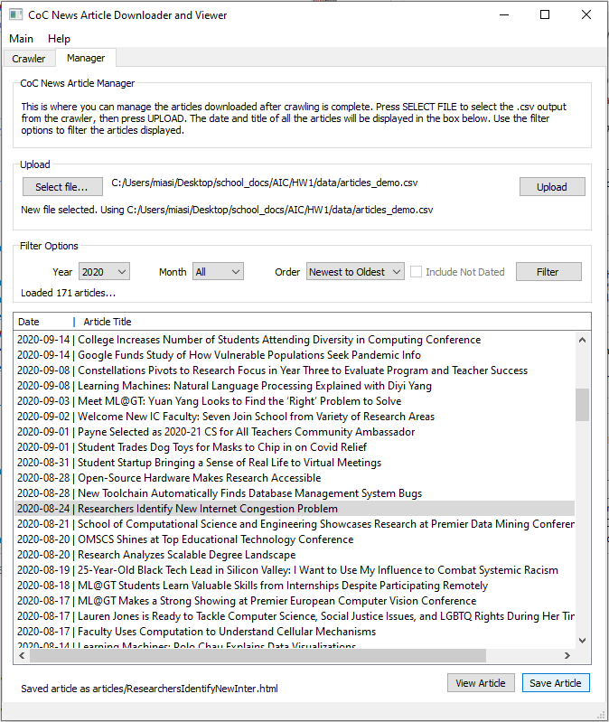

# CoC News Article Downloader and Viewer <!-- omit in toc -->
## CS 6675-Homework 2-Option 1.2: Write a Web Crawler of your own <!-- omit in toc -->

### Table of Contents <!-- omit in toc -->
- [Introduction](#introduction)
  - [Prerequisites](#prerequisites)
- [Design and Usage](#design-and-usage)
  - [Crawler Tab](#crawler-tab)
  - [Manager Tab](#manager-tab)
- [Future Work](#future-work)
- [Contact](#contact)

### Introduction
For this assignment I decided to crawl the news articles on the College of Computing (CoC) website. The seed URL is the main page of the [CoC news page](https://www.cc.gatech.edu/news/1). Each page list news articles for a user to choose from and each article listed is linked to a URL to read the full article. I chose this seed URL because I knew I could easily access at least 1,000 URLs from it, being that there are 64 pages listing about 20 articles each. The publishing year range that these articles span is 2011-2021.

**Note for the person that's grading this assignment:** I made an app, but it is not neccessary to use the app to run the crawler. See the [Crawler Tab](#crawler-tab) section on how to run the crawler without using the app.

#### Prerequisites
The folder `jones.programming1` should be downloaded and the folder structure is shown below:
```
jones.programming1
├── code
|   ├── app.py
|   └── web_crawler.py
├── data
|   ├── articles_demo.csv
|   ├── queue_stats_demo.csv
|   └── visited_stats_demo.csv
├── misc
├── README.md
└── report.pdf
```
Python 3 is required to run all Python files. The necessary Python packages needed to run this crawler are `requests`, `pandas`, `beautifulsoup4`, and `PyQt5`. Use `pip install -r requirements.txt` in a virtual environment to install the necessary packages.

### Design and Usage 
The web crawler is designed to extract the title, date, and URL of every article listed on the CoC news pages. Each article URL is visited and its HTML content is extracted. All of this information is then saved into a .csv file.

I created an app using PyQt5 that can crawl the CoC News website and manage the downloaded articles. To open the app, switch to the `jones.programming1\code` directory and run the following command:
```
python app.py
```
#### Crawler Tab


When you first open the app you will see the Crawler tab where you can run the web crawler I created. Previous data that was extracted by the crawler is already included in this repository and is located in the `jones.programming1\data` folder (See `articles_demo.csv`). But if you would like to see this crawler in action, press START CRAWLER. Alternatively, you can run the crawler from a terminal using the command below. make sure you're in the `jones.programming1\code` directory. Don't worry, this will not overwrite the existing demo data.
```
python web_crawler.py
```
The output of the crawling progress will be shown in the terminal (see image below). After the crawler is finished, three new files located in `jones.programming1\data` called `articles.csv`, `queue_stats.csv`, and `visited_stats.csv` will be created.

*Note: I tried to show the terminal output in the app, but I was having issues :(*


#### Manager Tab


The Manager tab allows you to easily veiw the article content that the crawler extracted. Press SELECT FILE to select the .csv file the crawler outputted (i.e., articles.csv), then press UPLOAD. The date and title of each uploaded article will be displayed in the view box. You can scroll through the articles and use the filter options to filter the articles. To view a selected article by press VIEW ARTICLE or double-clicking the selected article. This will open your a temporary .html file in your web browser. You can save a selected article by pressing SAVE ARTICLE. This will create a folder called `articles\` where the saved article will can be found. Every .html file that is shown or saved will embed the actual URL to the article at the very top of the document as a clickable link called "Actual URL" (see image below).


### Future Work
- Fix funcitionality of "Include Not Dated" check box in Manager tab
- Add functional DELETE ARTICLE button in Manager Tab
- Prevent app from auto closing upon Python error

### Contact
This application was developed by Miasia Jones. Please contact me if there are any issues.

Email: mjones386@gatech.edu
